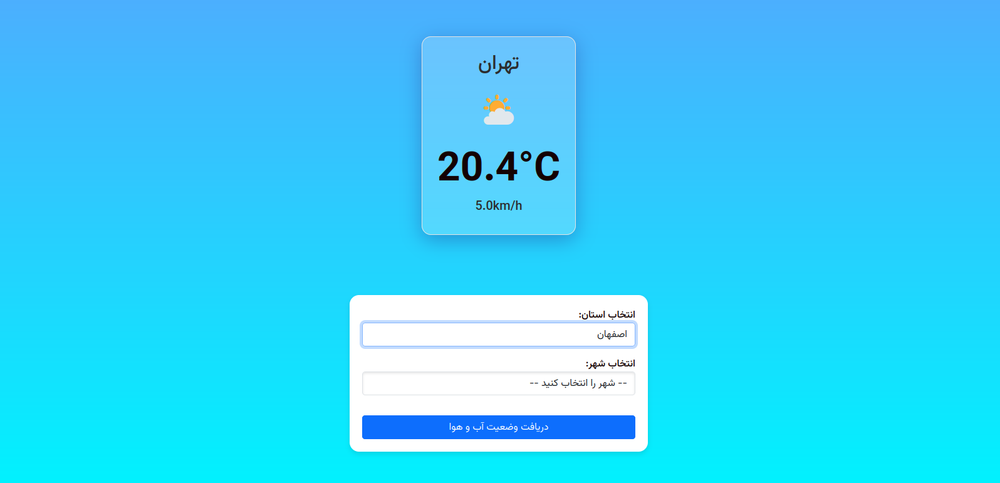
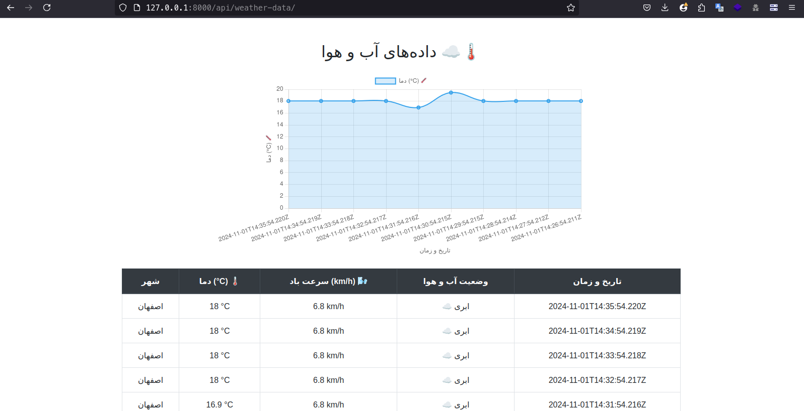

# Weather Data Display Project
This project is a web application that retrieves weather data from a server and displays it in both a chart and a table. The application uses WebSockets for real-time data updates and refreshes the data every minute.
## Using Django REST Framework
This project also utilizes Django REST Framework (DRF) to create RESTful APIs that allow for easy data interaction. DRF is a powerful toolkit for building Web APIs in Django.
## Using Django Channels
This project utilizes Django Channels to handle WebSocket connections. Django Channels extends Django to handle asynchronous protocols like WebSockets, allowing for real-time communication between the server and clients.

## Installation
1. **Clone the repository**

```bash
   git clone git@github.com:MaryaRezvani/weather_news_api.git
   cd weather_news_api
```
2. **Active enviroment in linux**
```bash
    python -m venv env
    source env/bin/activate
```
3. **Install dependencies**
```bash
    pip install -r requirements.txt
```
4. **Run the server**
```bash
    daphne -p 8000 weather_news_api.asgi:application
```

## Demo

Here are some screenshots demonstrating the functionality of the weather application:

<div style="display: flex; justify-content: center;">
    <div style="margin-right: 20px;">
        <h3>Weather Form</h3>
        
    </div>
    <div>
        <h3>Weather Data</h3>
        
    </div>
</div>

## Features
- Live temperature chart display
- Weather data table showing city, temperature, wind speed, weather status, and timestamp
- Automatic data updates every minute
- Responsive design using Bootstrap


